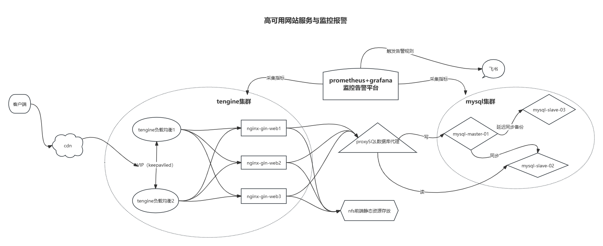
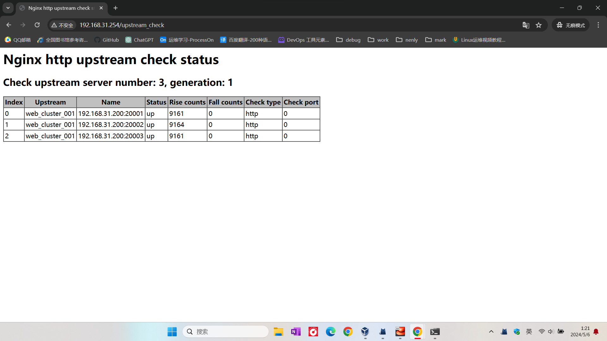
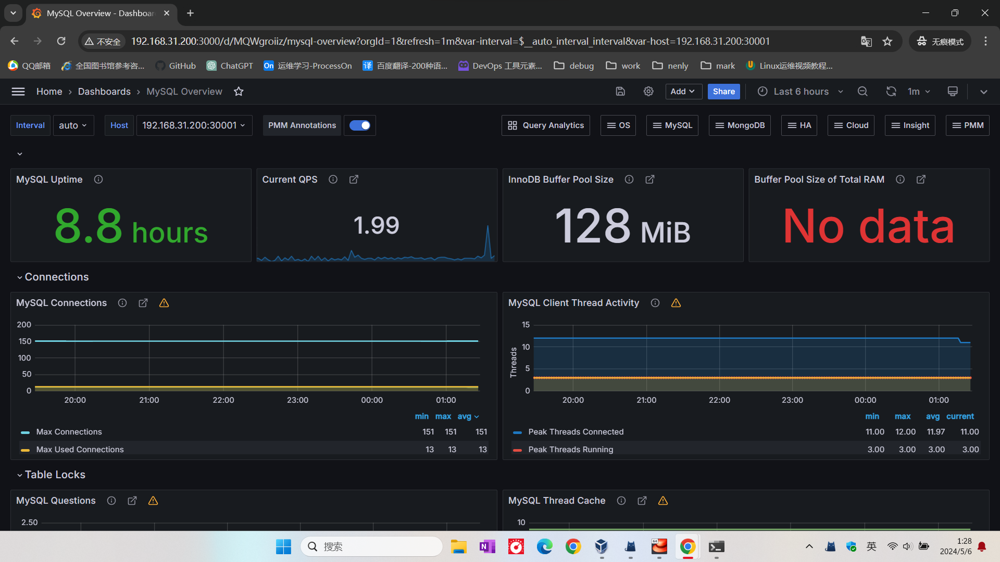
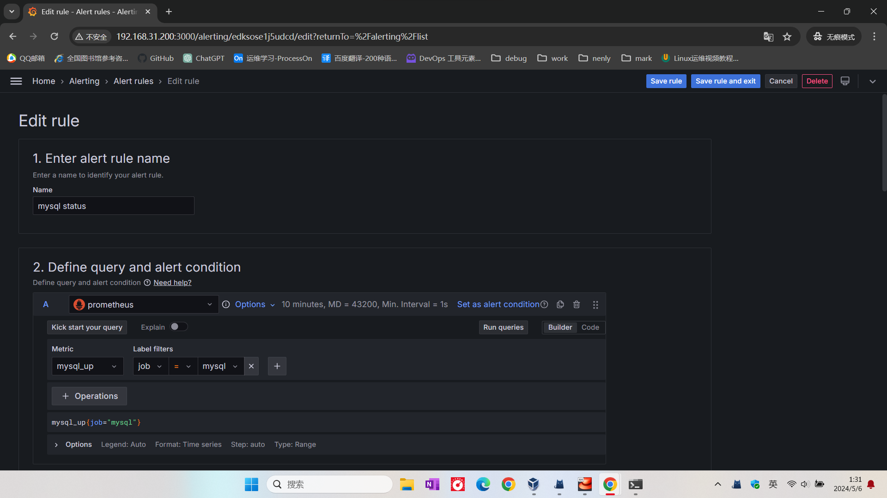
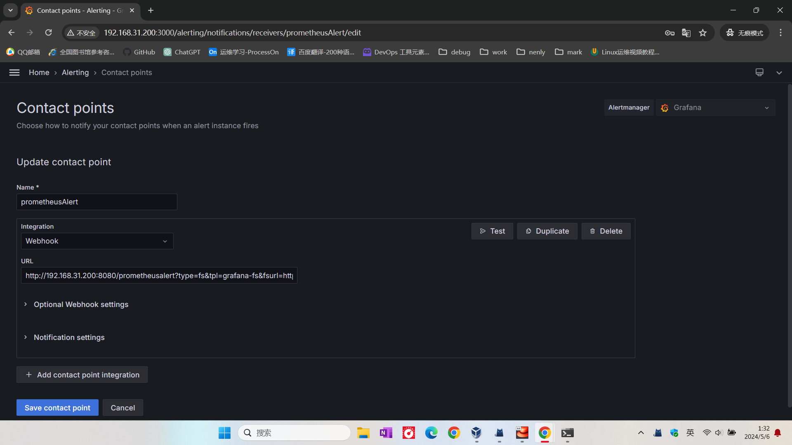
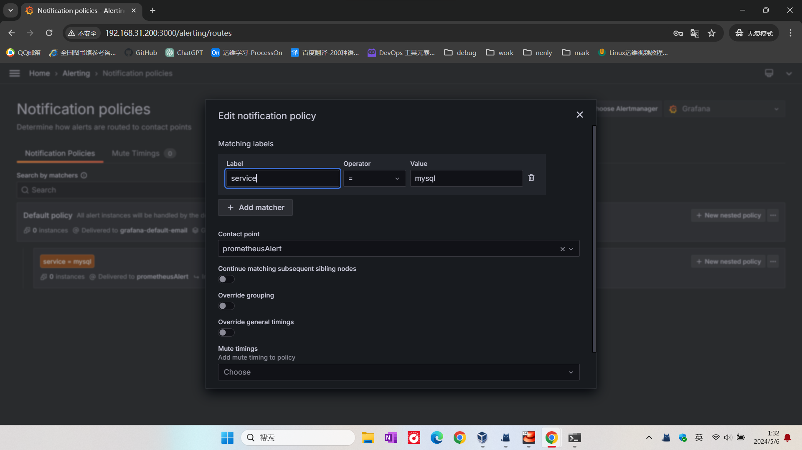
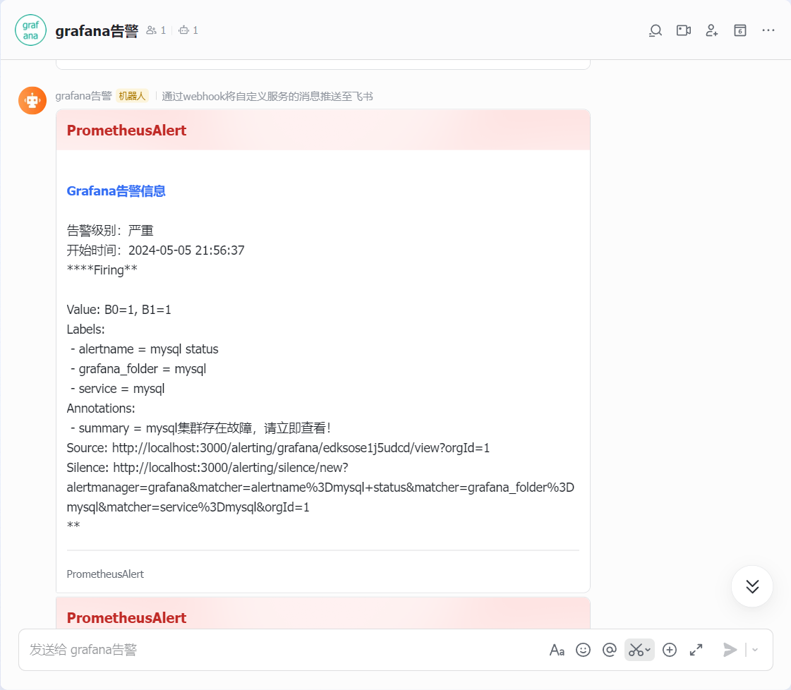

# keepavlied-tengine-gin-mysql-prometheus-grafana-prometheusAlert-feishu

高可用网站服务与监控报警

## 目录
<!-- vim-markdown-toc GFM -->

* [前言](#前言)
* [技术选型说明](#技术选型说明)
* [一、设计项目拓扑图](#一设计项目拓扑图)
* [二、mysql主从集群搭建](#二mysql主从集群搭建)
    * [安装mysql，配置主从复制](#安装mysql配置主从复制)
* [三、proxySQL数据库读写分离配置](#三proxysql数据库读写分离配置)
* [四、web集群搭建](#四web集群搭建)
    * [拉取go web项目源码，编译生成制品放到网站共享目录](#拉取go-web项目源码编译生成制品放到网站共享目录)
    * [搭建nfs服务共享前端资源](#搭建nfs服务共享前端资源)
    * [制作tengine和go web 镜像](#制作tengine和go-web-镜像)
    * [docker运行三个go web实例](#docker运行三个go-web实例)
    * [访问go web验证](#访问go-web验证)
* [五、tengine负载均衡和健康检查配置](#五tengine负载均衡和健康检查配置)
    * [在机器192.168.31.200 loadbalancer-001上](#在机器19216831200-loadbalancer-001上)
    * [在192.168.31.201 loadbalancer-002上](#在19216831201-loadbalancer-002上)
    * [访问VIP对应路由查看暴露的指标](#访问vip对应路由查看暴露的指标)
* [六、监控平台搭建](#六监控平台搭建)
    * [指标采集：prometheus部署](#指标采集prometheus部署)
    * [可视化展示：grafana](#可视化展示grafana)
    * [告警：prometheusAlert + 飞书](#告警prometheusalert--飞书)
* [todo](#todo)

<!-- vim-markdown-toc -->

## 前言
本项目模拟企业网站服务的部署流程和常用技术手段，基于tengine代理和keepalived实现了网站服务的高并发性和高可用性，同时针对后端数据库完成了主从复制备份和读写分离结构部署，并借助tenginx的拓展模块（主动健康检查、指标统计等）、prometheus指标采集服务、grafana绘图服务以及开源告警消息转发系统prometheusAlert对集群的核心服务进行监控告警，并对一些关键指标（延迟、流量、错误、饱和度）做可观测性，以便及时暴露问题、预测风险、规避风险。

## 技术选型说明
1. 数据库

采用mysql社区版，为了方便搭建，这里依托docker容器技术部署，镜像`mysql:5.7.43`，mysql-master-001只写、mysql-slave-002只读、mysql-slave-003只读并设置延迟备份一小时，作为灾备数据库。mysql读写分离由proxySQL实现。

2. 网站

用gin + nodejs开发的一个开源网站https://github.com/flipped-aurora/gin-vue-admin，网站服务器选择tenginx，并挂载nfs共享目录来统一前端静态资源。Dockerfile制作镜像部署三个节点在dokcer中

3. 负载均衡

采用tengine负载均衡，并设置健康检查以及暴露统计指标，keepalived负责负载均衡器健康检查和高可用实现

4. 指标采集、可观测性、告警 

prometheus作为指标采集服务器主动拉取exporter端数据，用grafana对采集的指标进行绘图展示以及配合告警组件prometheusAlert设置告警规则告警给飞书

## 一、设计项目拓扑图 


## 二、mysql主从集群搭建

### 安装mysql，配置主从复制
1. 启动三个mysql实例

```
docker run -p 30001:3306 --name mysql-master-001 -v ~/docments/docker/mysql/my_master_001.cnf:/etc/my.cnf -e MYSQL_ROOT_PASSWORD=200122@Root -d mysql:5.7.43
docker run -p 30002:3306 --name mysql-slave-001 -v ~/docments/docker/mysql/my_slave_001.cnf:/etc/my.cnf -e MYSQL_ROOT_PASSWORD=200122@Root -d mysql:5.7.43
docker run -p 30003:3306 --name mysql-slave-002 -v ~/docments/docker/mysql/my_slave_002.cnf:/etc/my.cnf -e MYSQL_ROOT_PASSWORD=200122@Root -d mysql:5.7.43

[root@loadbalancer-001 ~]# docker ps | grep mysql:5.7.43
abba83d34105   mysql:5.7.43       "docker-entrypoint.s…"   8 hours ago   Up 8 hours   33060/tcp, 0.0.0.0:30003->3306/tcp, :::30003->3306/tcp   mysql-slave-002
87a1d1584fc6   mysql:5.7.43       "docker-entrypoint.s…"   8 hours ago   Up 8 hours   33060/tcp, 0.0.0.0:30002->3306/tcp, :::30002->3306/tcp   mysql-slave-001
f9b211c2920d   mysql:5.7.43       "docker-entrypoint.s…"   8 hours ago   Up 8 hours   33060/tcp, 0.0.0.0:30001->3306/tcp, :::30001->3306/tcp   mysql-master-001
```

mysql-master-001配置文件：
```
[mysqld]
server_id=1
log_bin
gtid-mode=on
enforce-gtid-consistency=on
```

mysql-slave-001配置文件：
```
[mysqld]
server_id=1
server_id=2
log_bin
gtid-mode=on
enforce-gtid-consistency=on
```

mysql-slave-002配置文件：
```
[mysqld]
server_id=1
server_id=3
log_bin
gtid-mode=on
enforce-gtid-consistency=on
```

2. mysql-master-001创建备份专用用户

```
create user 'backup'@'%' identified by '200122@Backup';
grant replication slave on *.* to 'backup'@'%';
```

3. 配置mysql-slave-001和mysql-slave-002为从节点，其中后者配置为延迟1小时同步

```
CHANGE MASTER TO MASTER_HOST='192.168.31.200', 
MASTER_USER='backup',
MASTER_PASSWORD='200122@Backup',
MASTER_PORT=30001,
master_auto_position=1;

# mysql-slave-002配置延迟备份
CHANGE MASTER TO MASTER_DELAY = 3600;

# 启动从节点开始同步
start slave;
```

## 三、proxySQL数据库读写分离配置
1. 在mysql服务里面创建给proxySql访问的用户

创建主用户，用来暴露自己的api给proxySql
```
# mysql-master-001上执行
GRANT ALL PRIVILEGES ON *.* TO 'proxy'@'%' identified by '200122@Proxy'  WITH GRANT OPTION;
```

创建监控用户，该用户可以查看本机mysql服务的只读属性
```
create user proxy_monitor@'%' identified by '200122@Proxy_monitor';
grant replication client on *.* to proxy_monitor@'%';
```

设置从服务器为只读
```
SET GLOBAL read_only = ON;
SHOW GLOBAL VARIABLES LIKE 'read_only';
```

2. 添加mysql_servers表数据

通过在mysql_servers表中添加、更新或删除记录，你可以动态地配置ProxySQL与后端MySQL服务器的连接和负载均衡设置。
```
mysql -uadmin -padmin -h127.0.0.1 -P6032 main

insert into mysql_servers(hostgroup_id,hostname,port)  values(20,'192.168.31.200',30002);
insert into mysql_servers(hostgroup_id,hostname,port)  values(10,'192.168.31.200',30001);

# 数据持久化 
load mysql servers to runtime;
save mysql servers to disk;
```

3. 配置读写库组id

```
insert into mysql_replication_hostgroups(writer_hostgroup,reader_hostgroup,check_type) values(10,20,'read_only');

load mysql servers to runtime;
save mysql servers to disk;
```

4. 配置用户表

```
insert into mysql_users(username,password,default_hostgroup) values('proxy','200122@Proxy',10);

load mysql users to runtime;
save mysql users to disk;
```

5. 设置mysql的监控用户

```
set mysql-monitor_username='proxy_monitor';
set mysql-monitor_password='200122@Proxy_monitor';

load mysql variables to runtime;
save mysql variables to disk;
```

6. 配置proxySql读写分离规则

```
INSERT INTO mysql_query_rules (rule_id, active, match_pattern, destination_hostgroup, apply)
VALUES (1, 1, '^SELECT.*', 20, 1),
       (2, 1, '.*', 10, 1); 

load mysql query rules to runtime;
save mysql query rules to disk;
```

7. 验证读写分离
登录proxySQL管理服务：mysql -uadmin -padmin -h127.0.0.1 -P6032 stats

查看每条sql语句是被谁执行的：select hostgroup,schemaname,username,digest_text,count_star from  stats_mysql_query_digest\G;
```
[root@loadbalancer-001 ~]# mysql -uadmin -padmin -h127.0.0.1 -P6032 stats
Reading table information for completion of table and column names
You can turn off this feature to get a quicker startup with -A

Welcome to the MariaDB monitor.  Commands end with ; or \g.
Your MySQL connection id is 32
Server version: 5.5.30 (ProxySQL Admin Module)

Copyright (c) 2000, 2018, Oracle, MariaDB Corporation Ab and others.

Type 'help;' or '\h' for help. Type '\c' to clear the current input statement.

MySQL [stats]> select hostgroup,schemaname,username,digest_text,count_star from  stats_mysql_query_digest\G;
*************************** 1. row ***************************
  hostgroup: 10
 schemaname: information_schema
   username: proxy
digest_text: flush privileges
 count_star: 2
*************************** 2. row ***************************
  hostgroup: 20
 schemaname: mysql
   username: proxy
digest_text: SELECT DATABASE()
 count_star: 1
*************************** 3. row ***************************
  hostgroup: 10
 schemaname: information_schema
   username: proxy
digest_text: drop go_gin_web
 count_star: 1
*************************** 4. row ***************************
  hostgroup: 10
 schemaname: go_gin_web
   username: proxy
digest_text: ALTER TABLE `sys_base_menus` ADD `id` bigint unsigned AUTO_INCREMENT,ADD PRIMARY KEY (`id`)
 count_star: 2
*************************** 5. row ***************************
  hostgroup: 20
 schemaname: go_gin_web
   username: proxy
digest_text: SELECT count(*) FROM information_schema.statistics WHERE table_schema = ? AND table_name = ? AND index_name = ?
 count_star: 8
*************************** 6. row ***************************
  hostgroup: 20
 schemaname: go_gin_web
   username: proxy
digest_text: select * from sys_users
 count_star: 9
*************************** 7. row ***************************
  hostgroup: 20
 schemaname: go_gin_web
   username: proxy
digest_text: SELECT * FROM `sys_users` WHERE ?=?
 count_star: 1
*************************** 8. row ***************************
  hostgroup: 20
 schemaname: go_gin_web
   username: proxy
digest_text: SELECT * FROM `sys_base_menus` WHERE ?=?
 count_star: 1
*************************** 9. row ***************************
  hostgroup: 20
 schemaname: go_gin_web
   username: proxy
digest_text: SELECT * FROM `sys_authority_menus` WHERE ?=?
 count_star: 1
*************************** 10. row ***************************
  hostgroup: 20
 schemaname: go_gin_web
   username: proxy
digest_text: SELECT * FROM `sys_apis` WHERE ?=?
 count_star: 1
*************************** 11. row ***************************
  hostgroup: 10
 schemaname: go_gin_web
   username: proxy
digest_text: CREATE TABLE `sys_users` (`id` bigint unsigned AUTO_INCREMENT,`created_at` datetime(?) NULL,`updated_at` datetime(?) NULL,`deleted_at` datetime(?) NULL,`uuid` varchar(?) COMMENT ?,`username` varchar(?) COMMENT ?,`password` varchar(?) COMMENT ?,`nick_name` varchar(?) DEFAULT ? COMMENT ?,`side_mode` varchar(?) DEFAULT ? COMMENT ?,`header_img` varchar(?) DEFAULT ? COMMENT ?,`base_color` varchar(?) DEFAULT ? COMMENT ?,`active_color` varchar(?) DEFAULT ? COMMENT ?,`authority_id` bigint unsigned DEFAULT ? COMMENT ?,`phone` varchar(?) COMMENT ?,`email` varchar(?) COMMENT ?,`enable` bigint DEFAULT ? COMMENT ?,PRIMARY KEY (`id`),INDEX `idx_sys_users_deleted_at` (`deleted_at`),INDEX `idx_sys_users_uuid` (`uuid`),INDEX `idx_sys_users_username` (`username`))
 count_star: 1
*************************** 12. row ***************************
  hostgroup: 10
 schemaname: go_gin_web
   username: proxy
digest_text: show tables
 count_star: 2
*************************** 13. row ***************************
  hostgroup: 20
 schemaname: go_gin_web
   username: proxy
digest_text: SELECT * FROM `sys_users` WHERE username = ? AND `sys_users`.`deleted_at` IS NULL ORDER BY `sys_users`.`id` LIMIT ?
 count_star: 6
*************************** 14. row ***************************
  hostgroup: 10
 schemaname: go_gin_web
   username: proxy
digest_text: ALTER TABLE `sys_dictionaries` ADD `id` bigint unsigned AUTO_INCREMENT,ADD PRIMARY KEY (`id`)
 count_star: 1
*************************** 15. row ***************************
  hostgroup: 20
 schemaname: go_gin_web
   username: proxy
digest_text: SELECT column_name,column_default,is_nullable = ?,data_type,character_maximum_length,column_type,column_key,extra,column_comment,numeric_precision,numeric_scale,datetime_precision FROM information_schema.columns WHERE table_schema = ? AND table_name = ? ORDER BY ORDINAL_POSITION
 count_star: 10
```

## 四、web集群搭建

### 拉取go web项目源码，编译生成制品放到网站共享目录
这里参考https://github.com/flipped-aurora/gin-vue-admin

### 搭建nfs服务共享前端资源
```
cat >> /etc/exports << EOF
/mnt/shared/nginx *(rw,all_squash)
EOF

exportfs -a

chmod -R 0777 /mnt/shared/nginx 

[root@loadbalancer-001 ~]# ls -al /mnt/shared/nginx/
total 70720
drwxrwxrwx. 6 root root       93 May  5 17:13 .
drwxr-xr-x. 3 root root       19 May  5 16:18 ..
-rwxrwxrwx. 1 root root     4934 May  5 17:12 config.yaml
drwxrwxrwx. 3 root root       38 May  5 16:19 dist
drwxrwxrwx. 3 root root       24 May  5 16:35 log
drwxrwxrwx. 5 root root       64 May  5 16:58 resource
-rwxrwxrwx. 1 root root 72405744 May  5 16:19 server
drwxr-xr-x. 3 root root       18 May  5 17:13 uploads
```

### 制作tengine和go web 镜像
1. 制作tengine镜像`tengine:3.0.0`
```
[root@loadbalancer-001 tengine-docker-image]# tree .
.
├── conf.d
│   ├── default.conf
│   └── loadbalancer.conf
├── Dockerfile
├── nginx.conf
└── README.md

1 directory, 5 files
[root@loadbalancer-001 tengine-docker-image]# cat Dockerfile
FROM centos:7.9.2009

ENV TENGINE_VERSION 3.0.0

ENV CONFIG "\
        --prefix=/usr/local/nginx \
        --add-module=modules/ngx_http_reqstat_module \
        --add-module=modules/ngx_http_upstream_check_module \
        "

WORKDIR /opt/tengine

RUN yum install -y gcc pcre pcre-devel openssl openssl-devel \
        && curl -L "https://github.com/alibaba/tengine/archive/$TENGINE_VERSION.tar.gz" -o tengine.tar.gz \
        && mkdir -p /usr/local/src \
        && tar -zxC /usr/local/src -f tengine.tar.gz \
        && rm tengine.tar.gz \
        && cd /usr/local/src/tengine-$TENGINE_VERSION \
        && ./configure $CONFIG \
        && make \
        && make install \
        && mkdir -p /usr/local/nginx/conf/conf.d

COPY nginx.conf /usr/local/nginx/conf/nginx.conf
COPY conf.d/default.conf /usr/local/nginx/conf/conf.d/default.conf

EXPOSE 80 443

CMD ["/usr/local/nginx/sbin/nginx", "-g", "daemon off;"]
```

2. 基于`tengine:3.0.0`制作go web镜像`go-gin-web:2.6.2`
```
[root@loadbalancer-001 docker]# cat Dockerfile
FROM tengine:3.0.0

WORKDIR /opt/go-gin-web

ENV LANG=en_US.utf8

COPY deploy/docker/entrypoint.sh .
COPY deploy/docker/build/ /usr/local/nginx/html/
COPY web/.docker-compose/nginx/conf.d/nginx.conf /usr/local/nginx/conf/conf.d/default.conf

RUN set -ex \
    && echo "LANG=en_US.utf8" > /etc/locale.conf \
    && chmod +x ./entrypoint.sh \
    && echo "start" > /dev/null

EXPOSE 80 443

ENTRYPOINT ["/opt/go-gin-web/entrypoint.sh"]
[root@loadbalancer-001 docker]# cat entrypoint.sh
#!/bin/bash
cd /usr/local/nginx/html/ && ./server &
/usr/local/nginx/sbin/nginx -g "daemon off;"
echo "gva ALL start!!!"
tail -f /dev/null 
```

### docker运行三个go web实例
```
docker run -d -p 20001:80 --name go-gin-web-001 -v /mnt/shared/nginx:/usr/local/nginx/html go-gin-web:2.6.2
docker run -d -p 20002:80 --name go-gin-web-002 -v /mnt/shared/nginx:/usr/local/nginx/html go-gin-web:2.6.2
docker run -d -p 20003:80 --name go-gin-web-003 -v /mnt/shared/nginx:/usr/local/nginx/html go-gin-web:2.6.2

[root@loadbalancer-001 ~]# docker ps | grep go-gin-web:2.6.2
caf5c3827ed4   go-gin-web:2.6.2   "/opt/go-gin-web/ent…"   7 hours ago   Up 7 hours   443/tcp, 0.0.0.0:20003->80/tcp, :::20003->80/tcp         go-gin-web-003
29d5cdfe8666   go-gin-web:2.6.2   "/opt/go-gin-web/ent…"   7 hours ago   Up 7 hours   443/tcp, 0.0.0.0:20002->80/tcp, :::20002->80/tcp         go-gin-web-002
af2d138dbb60   go-gin-web:2.6.2   "/opt/go-gin-web/ent…"   7 hours ago   Up 7 hours   443/tcp, 0.0.0.0:20001->80/tcp, :::20001->80/tcp         go-gin-web-001
```

### 访问go web验证
浏览器地址栏输入：192.168.31.200:20003


## 五、tengine负载均衡和健康检查配置

### 在机器192.168.31.200 loadbalancer-001上

主配置文件/usr/local/nginx/conf/nginx.conf
```
#user  nobody;
worker_processes  auto;

#error_log  logs/error.log;
#error_log  logs/error.log  notice;
#error_log  logs/error.log  info;
#error_log  "pipe:rollback logs/error_log interval=1d baknum=7 maxsize=2G";

#pid        logs/nginx.pid;


events {
    worker_connections  5000;
}


http {
    include       mime.types;
    default_type  application/octet-stream;

    #log_format  main  '$remote_addr - $remote_user [$time_local] "$request" '
    #                  '$status $body_bytes_sent "$http_referer" '
    #                  '"$http_user_agent" "$http_x_forwarded_for"';

    #access_log  logs/access.log  main;
    #access_log  "pipe:rollback logs/access_log interval=1d baknum=7 maxsize=2G"  main;

    sendfile        on;
    #tcp_nopush     on;

    #keepalive_timeout  0;
    keepalive_timeout  65;

    #gzip  on;

    include /usr/local/nginx/conf/conf.d/*.conf;
}
```

cat /usr/local/nginx/conf/conf.d/loadbalancer.conf
```
req_status_zone server "$host $server_addr:$server_port" 10M;


upstream web_cluster_001 {
    server 192.168.31.200:20001;
    server 192.168.31.200:20002;
    server 192.168.31.200:20003;

    check interval=3000 rise=2 fall=5 timeout=1000 type=http;
    check_keepalive_requests 100;
    check_http_expect_alive http_2xx http_3xx;
}


server {
    listen       80;
    server_name  localhost;

    #access_log  /var/log/nginx/host.access.log  main;

    location /upstream_check {
        check_status;
    }

    location /nginx_reqstat {
        req_status_show;
    }

    req_status server;

    location / {
        proxy_pass http://web_cluster_001;
    }

    location /nginx_status {
        stub_status on;
    }

    #error_page  404              /404.html;

    # redirect server error pages to the static page /50x.html
    #
    error_page   500 502 503 504  /50x.html;
    location = /50x.html {
        root   /usr/share/nginx/html;
    }

    # proxy the PHP scripts to Apache listening on 127.0.0.1:80
    #
    #location ~ \.php$ {
    #    proxy_pass   http://127.0.0.1;
    #}

    # pass the PHP scripts to FastCGI server listening on 127.0.0.1:9000
    #
    #location ~ \.php$ {
    #    root           html;
    #    fastcgi_pass   127.0.0.1:9000;
    #    fastcgi_index  index.php;
    #    fastcgi_param  SCRIPT_FILENAME  /scripts$fastcgi_script_name;
    #    include        fastcgi_params;
    #}

    # deny access to .htaccess files, if Apache's document root
    # concurs with nginx's one
    #
    #location ~ /\.ht {
    #    deny  all;
    #}
}
```

keepavlied配置：/etc/keepalived/keepalived.conf
```
! Configuration File for keepalived
global_defs {
router_id master-node
}
vrrp_script chk_http_port {
                      script  "/etc/keepalived/check_nginx.sh"
                      interval 1
                      weight -5
                      fall 1
                      rise 1
                     }
vrrp_instance VI_1 {
                state MASTER
                interface enp0s3
                virtual_router_id 51
                priority 101
                advert_int 1
                authentication {
                              auth_type PASS
                              auth_pass 1111
                             }
                virtual_ipaddress {
                             192.168.31.254
                             }
track_script {
           chk_http_port
            }
}
```

loadbalancer健康检查脚本：/etc/keepalived/check_nginx.sh
```
#!/bin/sh

APISERVER_DEST_PORT=80
APISERVER_VIP=192.168.31.254

errorExit() {
    echo "*** $*" 1>&2
    exit 1
}

curl --silent --max-time 2 --insecure http://localhost:${APISERVER_DEST_PORT}/ -o /dev/null || errorExit "Error GET http://localhost:${APISERVER_DEST_PORT}/"
if ip addr | grep -q ${APISERVER_VIP}; then
    curl --silent --max-time 2 --insecure http://${APISERVER_VIP}:${APISERVER_DEST_PORT}/ -o /dev/null || errorExit "Error GET http://${APISERVER_VIP}:${APISERVER_DEST_PORT}/"
fi
```

### 在192.168.31.201 loadbalancer-002上

keepavlied配置：/etc/keepalived/keepalived.conf
```
! Configuration File for keepalived
global_defs {
router_id master-node
}
vrrp_script chk_http_port {
                      script  "/etc/keepalived/check_nginx.sh"
                      interval 1
                      weight -5
                      fall 1
                      rise 1
                     }
vrrp_instance VI_1 {
                state BACKUP
                interface enp0s3
                virtual_router_id 51
                priority 100
                advert_int 1
                authentication {
                              auth_type PASS
                              auth_pass 1111
                             }
                virtual_ipaddress {
                             192.168.31.254
                             }
track_script {
           chk_http_port
            }
}
```

其他配置同loadbalancer-001一致

通过以上配置可以得到VIP 192.168.31.254

### 访问VIP对应路由查看暴露的指标
1. 访问http://192.168.31.254/nginx_status


2. 访问http://192.168.31.254/nginx_restat


2. 访问http://192.168.31.254/upstream_check



## 六、监控平台搭建

### 指标采集：prometheus部署
1. 安装mysqld-exporter

参考：https://github.com/prometheus/mysqld_exporter

2. 安装node-exporter

参考：https://github.com/prometheus/node_exporter

3. 开发tengine-exporter，自定义采集网站相关指标
```
#!/usr/bin/env python3


import re
import time
import requests
from prometheus_client import start_http_server, Gauge


# Nginx服务器列表
NGINX_SERVERS = [
    {'name': 'loadbalancer_vip', 'type': 'loadbalancer', 'url': 'http://192.168.31.254:80/'},
    {'name': 'web_001', 'type': 'web', 'url': 'http://192.168.31.200:20001/'},
    {'name': 'web_002', 'type': 'web', 'url': 'http://192.168.31.200:20002/'},
    {'name': 'web_003', 'type': 'web', 'url': 'http://192.168.31.200:20003/'}
]

# 资源路径
PATH = {"status": "nginx_status", "reqstat": "nginx_reqstat"}

# 创建nginx status指标
nginx_active_connections = Gauge('nginx_active_connections', 'Number of active connections in NGINX', labelnames=['server'])
nginx_accepted_connections = Gauge('nginx_accepted_connections', 'Number of accepted connections in NGINX', labelnames=['server'])
nginx_handled_connections = Gauge('nginx_handled_connections', 'Number of handled connections in NGINX', labelnames=['server'])
nginx_total_requests = Gauge('nginx_total_requests', 'Total number of requests handled by NGINX', labelnames=['server'])
nginx_request_time = Gauge('nginx_request_time', 'Average request time in NGINX (in milliseconds)', labelnames=['server'])
nginx_reading_connections = Gauge('nginx_reading_connections', 'Number of connections in NGINX reading request header', labelnames=['server'])
nginx_writing_connections = Gauge('nginx_writing_connections', 'Number of connections in NGINX writing response to client', labelnames=['server'])
nginx_waiting_connections = Gauge('nginx_waiting_connections', 'Number of idle connections in NGINX waiting for request', labelnames=['server'])

# 创建nginx restat指标
nginx_kv = Gauge('nginx_kv', 'kv', labelnames=['server'])
nginx_bytes_in = Gauge('nginx_bytes_in', 'Total bytes received from clients in NGINX', labelnames=['server'])
nginx_bytes_out = Gauge('nginx_bytes_out', 'Total bytes sent to clients in NGINX', labelnames=['server'])
nginx_conn_total = Gauge('nginx_conn_total', 'Total connections handled by NGINX', labelnames=['server'])
nginx_req_total = Gauge('nginx_req_total', 'Total requests handled by NGINX', labelnames=['server'])
nginx_http_2xx = Gauge('nginx_http_2xx', 'Total number of 2xx responses in NGINX', labelnames=['server'])
nginx_http_3xx = Gauge('nginx_http_3xx', 'Total number of 3xx responses in NGINX', labelnames=['server'])
nginx_http_4xx = Gauge('nginx_http_4xx', 'Total number of 4xx responses in NGINX', labelnames=['server'])
nginx_http_5xx = Gauge('nginx_http_5xx', 'Total number of 5xx responses in NGINX', labelnames=['server'])
nginx_http_other_status = Gauge('nginx_http_other_status', 'Total number of other responses in NGINX', labelnames=['server'])
nginx_rt = Gauge('nginx_rt', 'Total request time in NGINX', labelnames=['server'])
nginx_ups_req = Gauge('nginx_ups_req', 'Total requests to upstream in NGINX', labelnames=['server'])
nginx_ups_rt = Gauge('nginx_ups_rt', 'Total upstream request time in NGINX', labelnames=['server'])
nginx_ups_tries = Gauge('nginx_ups_tries', 'Total upstream tries in NGINX', labelnames=['server'])
nginx_http_200 = Gauge('nginx_http_200', 'Total number of 200 responses in NGINX', labelnames=['server'])
nginx_http_206 = Gauge('nginx_http_206', 'Total number of 206 responses in NGINX', labelnames=['server'])
nginx_http_302 = Gauge('nginx_http_302', 'Total number of 302 responses in NGINX', labelnames=['server'])
nginx_http_304 = Gauge('nginx_http_304', 'Total number of 304 responses in NGINX', labelnames=['server'])
nginx_http_403 = Gauge('nginx_http_403', 'Total number of 403 responses in NGINX', labelnames=['server'])
nginx_http_404 = Gauge('nginx_http_404', 'Total number of 404 responses in NGINX', labelnames=['server'])
nginx_http_416 = Gauge('nginx_http_416', 'Total number of 416 responses in NGINX', labelnames=['server'])
nginx_http_499 = Gauge('nginx_http_499', 'Total number of 499 responses in NGINX', labelnames=['server'])
nginx_http_500 = Gauge('nginx_http_500', 'Total number of 500 responses in NGINX', labelnames=['server'])
nginx_http_502 = Gauge('nginx_http_502', 'Total number of 502 responses in NGINX', labelnames=['server'])
nginx_http_503 = Gauge('nginx_http_503', 'Total number of 503 responses in NGINX', labelnames=['server'])
nginx_http_504 = Gauge('nginx_http_504', 'Total number of 504 responses in NGINX', labelnames=['server'])
nginx_http_508 = Gauge('nginx_http_508', 'Total number of 508 responses in NGINX', labelnames=['server'])
nginx_http_other_detail_status = Gauge('nginx_http_other_detail_status', 'Total number of other detailed status responses in NGINX', labelnames=['server'])
nginx_http_ups_4xx = Gauge('nginx_http_ups_4xx', 'Total number of upstream 4xx responses in NGINX', labelnames=['server'])
nginx_http_ups_5xx = Gauge('nginx_http_ups_5xx', 'Total number of upstream 5xx responses in NGINX', labelnames=['server'])


def update_metrics():
    for server in NGINX_SERVERS:
        response_text = get_nginx_metrics(server, PATH['status'])
        parse_nginx_status(server, response_text)

        if server['type'] == 'loadbalancer':
            response_text = get_nginx_metrics(server, PATH['reqstat'])
            parse_nginx_reqstat(server, response_text)


def get_nginx_metrics(server, metric):
    try:
        response = requests.get(url=server["url"] + metric)
        if response.status_code == 200:
            return response.text
        else:
            print(f"Failed to fetch NGINX status: {response.status_code}")
    except Exception as e:
        print(f"Failed to fetch NGINX status: {str(e)}")
    return None


def parse_nginx_status(server, nginx_status):
    if not nginx_status:
        return

    active_connections = re.search(r'Active connections:\s+(\d+)', nginx_status)
    if active_connections:
        nginx_active_connections.labels(server=server["name"]).set(int(active_connections.group(1)))

    accepted_handled_requests_time = re.search(r'\s+(\d+)\s+(\d+)\s+(\d+)\s+(\d+)', nginx_status)
    if accepted_handled_requests_time:
        accepted = int(accepted_handled_requests_time.group(1))
        handled = int(accepted_handled_requests_time.group(2))
        requests = int(accepted_handled_requests_time.group(3))
        request_time = int(accepted_handled_requests_time.group(4))

        nginx_accepted_connections.labels(server=server["name"]).set(accepted)
        nginx_handled_connections.labels(server=server["name"]).set(handled)
        nginx_total_requests.labels(server=server["name"]).set(requests)
        nginx_request_time.labels(server=server["name"]).set(request_time)

    reading = re.search(r'Reading:\s+(\d+)', nginx_status)
    if reading:
        nginx_reading_connections.labels(server=server["name"]).set(int(reading.group(1)))

    writing = re.search(r'Writing:\s+(\d+)', nginx_status)
    if writing:
        nginx_writing_connections.labels(server=server["name"]).set(int(writing.group(1)))

    waiting = re.search(r'Waiting:\s+(\d+)', nginx_status)
    if waiting:
        nginx_waiting_connections.labels(server=server["name"]).set(int(waiting.group(1)))


def parse_nginx_reqstat(server, nginx_status):
    if not nginx_status:
        return

    lines = nginx_status.strip().split('\n')
    for line in lines:
        kv, bytes_in, bytes_out, conn_total, req_total, http_2xx, http_3xx, http_4xx, http_5xx, http_other_status, rt, ups_req, ups_rt, ups_tries, http_200, http_206, http_302, http_304, http_403, http_404, http_416, http_499, http_500, http_502, http_503, http_504, http_508, http_other_detail_status, http_ups_4xx, http_ups_5xx = line.split(",")

        nginx_kv.labels(server=server["name"]).set(1)
        nginx_bytes_in.labels(server=server["name"]).set(bytes_in)
        nginx_bytes_out.labels(server=server["name"]).set(bytes_out)
        nginx_conn_total.labels(server=server["name"]).set(conn_total)
        nginx_req_total.labels(server=server["name"]).set(req_total)
        nginx_http_2xx.labels(server=server["name"]).set(http_2xx)
        nginx_http_3xx.labels(server=server["name"]).set(http_3xx)
        nginx_http_4xx.labels(server=server["name"]).set(http_4xx)
        nginx_http_5xx.labels(server=server["name"]).set(http_5xx)
        nginx_http_other_status.labels(server=server["name"]).set(http_other_status)
        nginx_rt.labels(server=server["name"]).set(rt)
        nginx_ups_req.labels(server=server["name"]).set(ups_req)
        nginx_ups_rt.labels(server=server["name"]).set(ups_rt)
        nginx_ups_tries.labels(server=server["name"]).set(ups_tries)
        nginx_http_200.labels(server=server["name"]).set(http_200)
        nginx_http_206.labels(server=server["name"]).set(http_206)
        nginx_http_302.labels(server=server["name"]).set(http_302)
        nginx_http_304.labels(server=server["name"]).set(http_304)
        nginx_http_403.labels(server=server["name"]).set(http_403)
        nginx_http_404.labels(server=server["name"]).set(http_404)
        nginx_http_416.labels(server=server["name"]).set(http_416)
        nginx_http_499.labels(server=server["name"]).set(http_499)
        nginx_http_500.labels(server=server["name"]).set(http_500)
        nginx_http_502.labels(server=server["name"]).set(http_502)
        nginx_http_503.labels(server=server["name"]).set(http_503)
        nginx_http_504.labels(server=server["name"]).set(http_504)
        nginx_http_508.labels(server=server["name"]).set(http_508)
        nginx_http_other_detail_status.labels(server=server["name"]).set(http_other_detail_status)
        nginx_http_ups_4xx.labels(server=server["name"]).set(http_ups_4xx)
        nginx_http_ups_5xx.labels(server=server["name"]).set(http_ups_5xx)


if __name__ == '__main__':
    # Start up the server to expose the metrics.
    start_http_server(port=8888, addr='0.0.0.0')

    while True:
        update_metrics()
        time.sleep(10)
```

5. prometheus主配置文件：prometheus.yml
```
# my global config
global:
  scrape_interval: 15s # Set the scrape interval to every 15 seconds. Default is every 1 minute.
  evaluation_interval: 15s # Evaluate rules every 15 seconds. The default is every 1 minute.
  # scrape_timeout is set to the global default (10s).

# Alertmanager configuration
alerting:
  alertmanagers:
    - static_configs:
        - targets:
          # - alertmanager:9093

# Load rules once and periodically evaluate them according to the global 'evaluation_interval'.
rule_files:
  # - "first_rules.yml"
  # - "second_rules.yml"

# A scrape configuration containing exactly one endpoint to scrape:
# Here it's Prometheus itself.
scrape_configs:
  # The job name is added as a label `job=<job_name>` to any timeseries scraped from this config.
  - job_name: "prometheus"

    # metrics_path defaults to '/metrics'
    # scheme defaults to 'http'.

    static_configs:
      - targets: ["192.168.31.200:9090"]

  - job_name: "node"
    file_sd_configs:
    - files:
      - 'node_targets.json'

  - job_name: "tengine"
    file_sd_configs:
    - files:
      - 'tengine_targets.json'

  - job_name: "mysql" # To get metrics about the mysql exporter’s targets
    file_sd_configs:
      - files:
        - 'mysql_targets.json'
    relabel_configs:
      - source_labels: [__address__]
        target_label: __param_target
      - source_labels: [__param_target]
        target_label: instance
      - target_label: __address__
        # The mysqld_exporter host:port
        replacement: 192.168.31.200:9104
```

6. 配置基于文件的动态服务发现，以便不用重启prometheus服务也能获取新服务的指标
```
[root@loadbalancer-001 prometheus-2.45.5.linux-amd64]# cat node_targets.json
[
  {
    "labels": {
      "job": "node"
    },
    "targets": [
      "192.168.31.200:9100"
    ]
  },
  {
    "labels": {
      "job": "node"
    },
    "targets": [
      "192.168.31.201:9100"
    ]
  }
]
[root@loadbalancer-001 prometheus-2.45.5.linux-amd64]# cat mysql_targets.json
[
  {
    "labels": {
      "job": "mysql"
    },
    "targets": [
      "192.168.31.200:30001",
      "192.168.31.200:30002"
    ]
  }
]
[root@loadbalancer-001 prometheus-2.45.5.linux-amd64]# cat tengine_targets.json
[
  {
    "labels": {
      "job": "tengine"
    },
    "targets": [
      "192.168.31.200:8888"
    ]
  }
]
```

### 可视化展示：grafana
1. 安装并启动服务

`nohup bin\grafana server &`

也可用systemd或supervisor来管理进程

2. 访问localhost:3000，进行账号初始化设置

3. 配置数据源为上面搭建好的prometheus服务


4. 按需创建dashboard（导入已有模板或自定义）



### 告警：prometheusAlert + 飞书 

以下以mysql_up指标为例配置告警

1. prometheusAlert安装参考：https://github.com/feiyu563/PrometheusAlert

2. 飞书webhook配置参考：https://feiyu563.gitbook.io/prometheusalert/conf/conf-feishu

3. 设置告警规则



4. 设置联络点



5. 配置通知策略 



6. 触发告警接收消息



## todo
mysql集群故障转移

网站访问日志集成分析，elk搭建

引入消息队列，削峰填谷

引入redis作为缓存服务器，提高数据库性能

cicd平台搭建 
